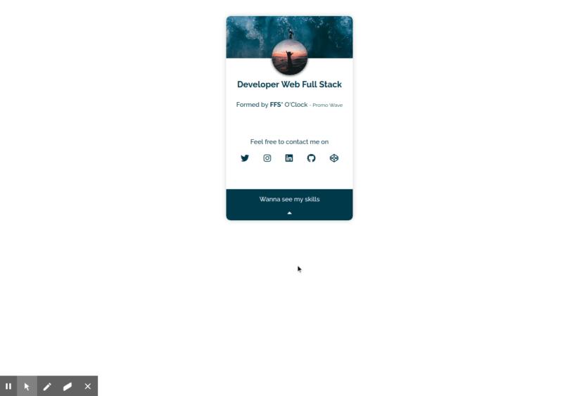

# My first side project at o'Clock School

## This is my first project done in parallel with the o'clock training.

It is produced in HTML, CSS and Javascript. 

I used the flexboxes as well as some animations.

### feel free to clone it and have fun with it.